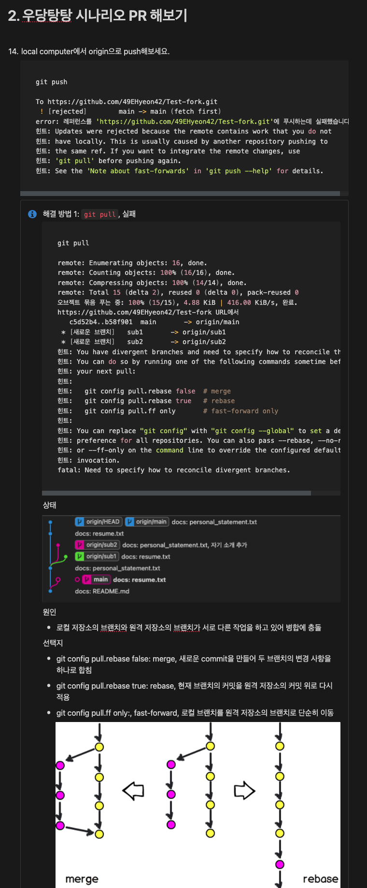
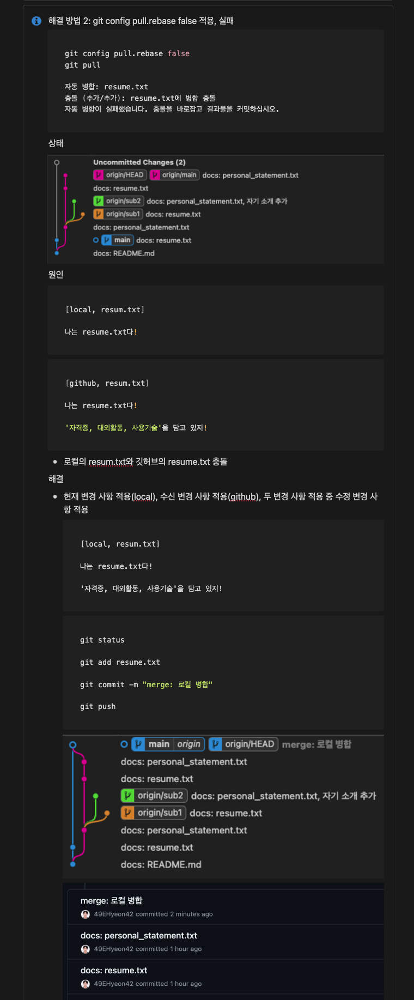
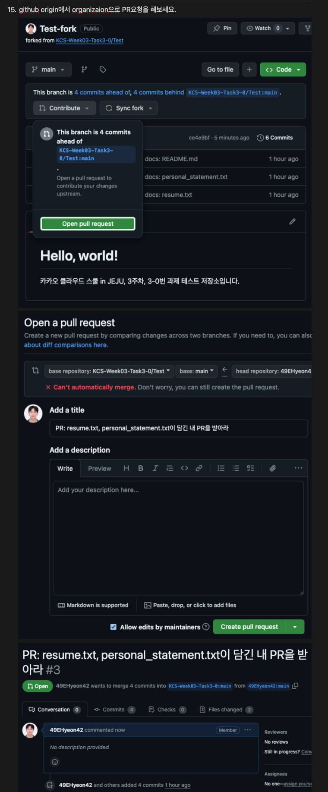
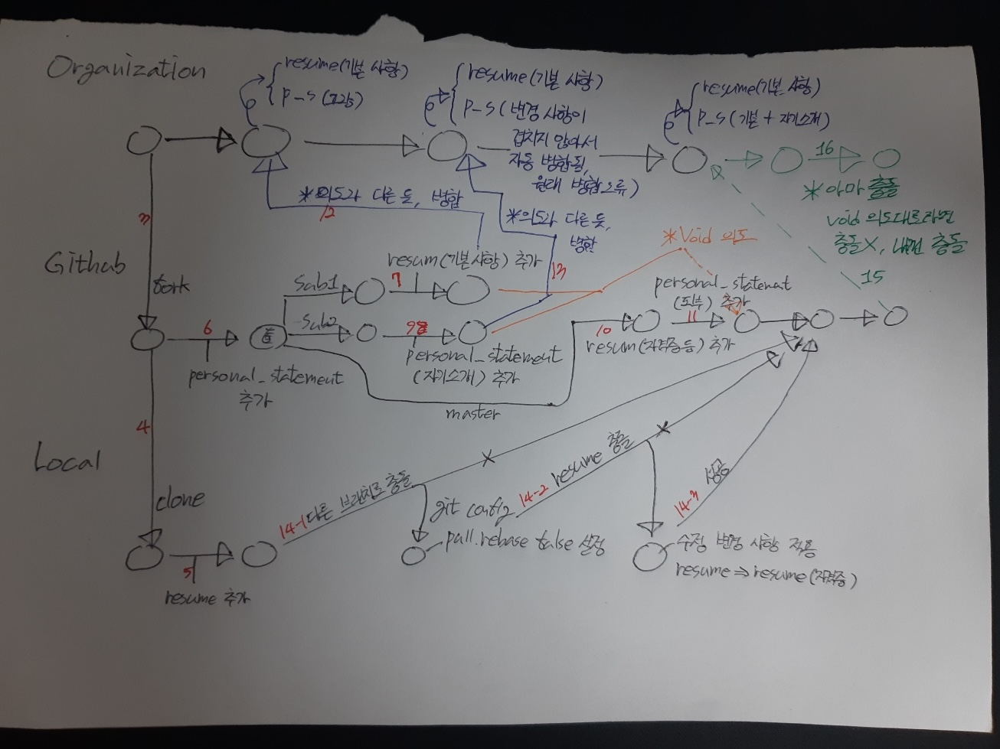

# Today I Learned

## 날짜: 2024-04-22

### 스크럼

- 학습 목표 1 : 개념 정리 (git)

### 새로 배운 내용

#### 주제 1: git 병합 충돌 체험

[git 미니 퀘스트](https://edu.startupcode.kr/b2289171-5ac0-404b-8808-51f41ba5fd38)를 진행하면서 merge, rebase, fast-forward에 대해 알게 되었다.

개인적인 노션 정리는 아래와 같다.

잘못된 PR로 미니 퀘스트와 조금 다르게 진행되었다. 확인이 늦었고, 병합 충돌 확인이 목적이라 생각해 무시하고 진행했다.

아래의 사진은 개인적으로 정리한 깃 그래프이다. 빨간색은 순서, 파란색은 잘못 진행한 부분, 주황색은 원래 의도, 초록색은 진행하지 않은 부분이다.

- organization: [링크](https://github.com/KCS-Week03-Task3-0/Test)
- github: [링크](https://github.com/49EHyeon42/Test-fork)

### 오늘의 도전 과제와 해결 방법

### 오늘의 회고

- 잘못된 PR로 어려운 관리를 더 어렵게 만들었다. 깃을 오래 사용했다 생각했음에도 아직 더 학습해야 할 것 같다.

### 참고 자료 및 링크
