# Today I Learned

## 날짜: 2024-04-23

### 스크럼

- 학습 목표 1 : Git 추가 정리

### 새로 배운 내용

#### 주제 1: Git 추가 정리

2024-04-23 때 작성한 Git 정리가 부족한 것 같아 추가하고자 한다. git에서 추천하는 3가지의 선택지들을 모두 확인하고자 한다.

##### 흐름도

```bash
# A
git clone 링크
```

```bash
# B
git clone 링크
```

```bash
# A

# README 수정

git add README.md

git commit -m "docs: A가 파일 수정"

git push
```

```bash
# B

# README.md 수정

git add README.md

git commit -m "docs: B가 파일 수정"

git push
To 링크
 ! [rejected]        main -> main (fetch first)
error: 레퍼런스를 '링크'에 푸시하는데 실패했습니다
힌트: Updates were rejected because the remote contains work that you do not
힌트: have locally. This is usually caused by another repository pushing to
힌트: the same ref. If you want to integrate the remote changes, use
힌트: 'git pull' before pushing again.
힌트: See the 'Note about fast-forwards' in 'git push --help' for details.
```

```bash
# B

git pull
remote: Enumerating objects: 5, done.
remote: Counting objects: 100% (5/5), done.
remote: Total 3 (delta 0), reused 3 (delta 0), pack-reused 0
오브젝트 묶음 푸는 중: 100% (3/3), 275 bytes | 68.00 KiB/s, 완료.
링크 URL에서
   08a8858..151482d  main       -> origin/main
힌트: You have divergent branches and need to specify how to reconcile them.
힌트: You can do so by running one of the following commands sometime before
힌트: your next pull:
힌트: 
힌트:   git config pull.rebase false  # merge
힌트:   git config pull.rebase true   # rebase
힌트:   git config pull.ff only       # fast-forward only
힌트: 
힌트: You can replace "git config" with "git config --global" to set a default
힌트: preference for all repositories. You can also pass --rebase, --no-rebase,
힌트: or --ff-only on the command line to override the configured default per
힌트: invocation.
fatal: Need to specify how to reconcile divergent branches.
```

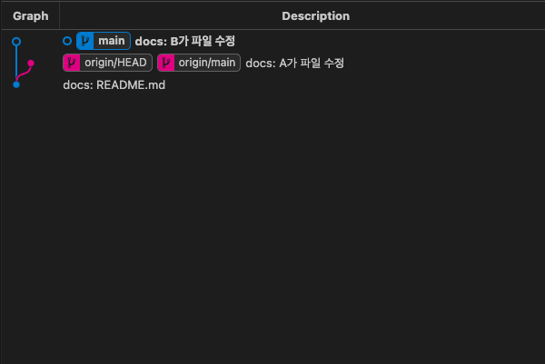

##### B는 3가지의 선택지가 주어진다

###### 1. merge

```bash
git config pull.rebase false

git pull
```

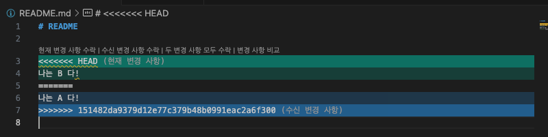

```bash
# README B가 작성한 것으로 선택

git add README.md

git commit -m "docs: B가 재수정"

git push
```

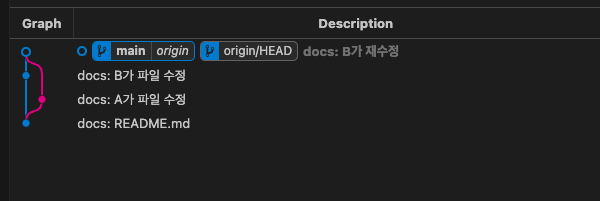

###### 2. rebase

```bash
git config pull.rebase true

git pull
```

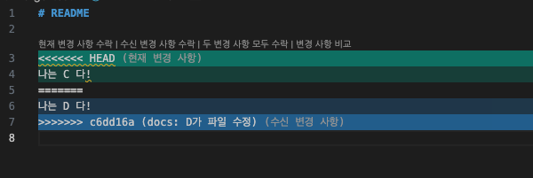

```bash
# README C가 작성한 것으로 선택

git add README.md

git commit -m "docs: D가 재수정, C가 수정한 것으로 선택"
대화형 리베이스 진행 중. 갈 위치는 8343306
Last command done (1 command done):
   pick c6dd16a docs: D가 파일 수정
명령이 남아있지 않음.
현재 'main' 브랜치를 '8343306' 위로 리베이스하는 중입니다.
  (모든 충돌을 바로잡았습니다: "git rebase --continue"를 실행하십시오)

커밋할 사항 없음, 작업 폴더 깨끗함
```

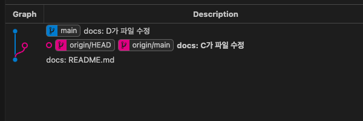

```bash
git rebase --continue
```

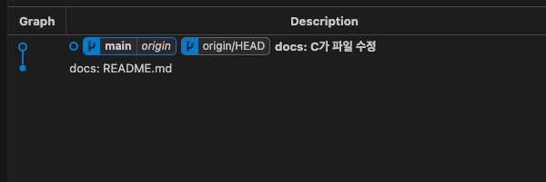

> [Question] README를 D가 수정한 방식으로 변경하면 rebase는 어떻게 될까?
>
> ```bash
> # README D가 작성한 것으로 선택
> 
> git add README.md
> 
> git commit -m "docs: D2가 C2를 버리고 D2 적용"
> ```
>
> 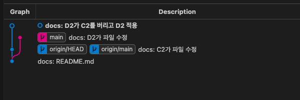
>
> ```bash
> git push
>
> fatal: 현재 어떤 브랜치 위에도 있지 않습니다.
> 지금 현재 (HEAD 분리) 상태까지의 커밋 내역을 푸시하려면
> 다음과 같이 하십시오.
> 
>   git push origin HEAD:<name-of-remote-branch>
> ```
>
> D가 수정한 방식을 선택하면 별도의 브랜치가 되기 때문에 rebase가 될 수 없다.

###### 3. fast-forward only

```bash
git config pull.ff only

git pull
힌트: Diverging branches can't be fast-forwarded, you need to either:
힌트: 
힌트:   git merge --no-ff
힌트: 
힌트: or:
힌트: 
힌트:   git rebase
힌트: 
힌트: Disable this message with "git config advice.diverging false"
```

> Fast-forward는 단순히 HEAD만 이동시키면 병합할 수 있는 환경에서만 사용할 수 있다. 즉, 지금과 같은 상황에서는 사용할 수 없다.

##### 병합의 3가지 전략

- Merge

    ```bash
    # fast-forward
    git merge --ff BRANCH

    # 또는 no fast-forward
    git merge --no-ff BRANCH
    ```

    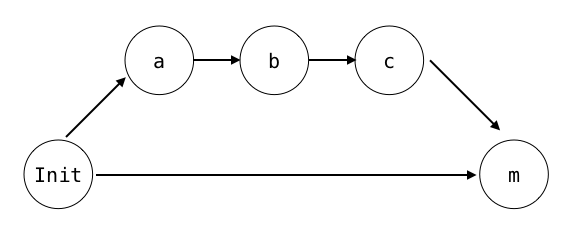

- Squash and Merge

    ```bash
    git merge --squash BRANCH
    ```

    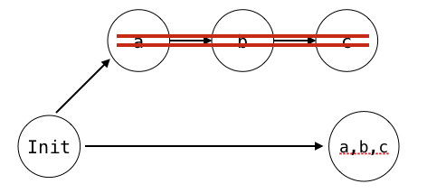

- Rebase and Merge

    ```bash
    # rebase는 git commit이 아니라 git rebase --continue 사용
    git rebase --continue
    ```

    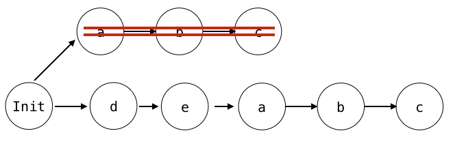

##### 브랜치별 병합 사용

- develop ← feature: Squash and Merge 유용
- master ← develop: Rebase and Merge 유용
- hotfix ← develop || hotfix ← master: Merge 또는 Squash Merge 사용

##### merge, rebase를 취소하고 싶다면?

```bash
# merge 
git merge --abort

# rebase
git rebase --abort
```

##### 개인 필기

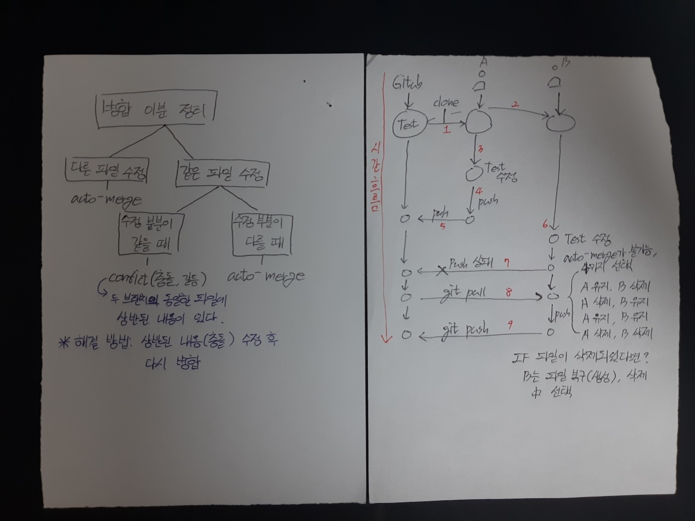

### 오늘의 도전 과제와 해결 방법

### 오늘의 회고

- 깃에 대한 이해도가 어제보다 높아진 것 같다.

### 참고 자료 및 링크

- [NHN Cloud Meet Up!, GitHub의 Merge, Squash and Merge, Rebase and Merge 정확히 이해하기](https://meetup.nhncloud.com/posts/122)
- [Visual studio 사용자를 위한 git](https://wikidocs.net/book/7060)
