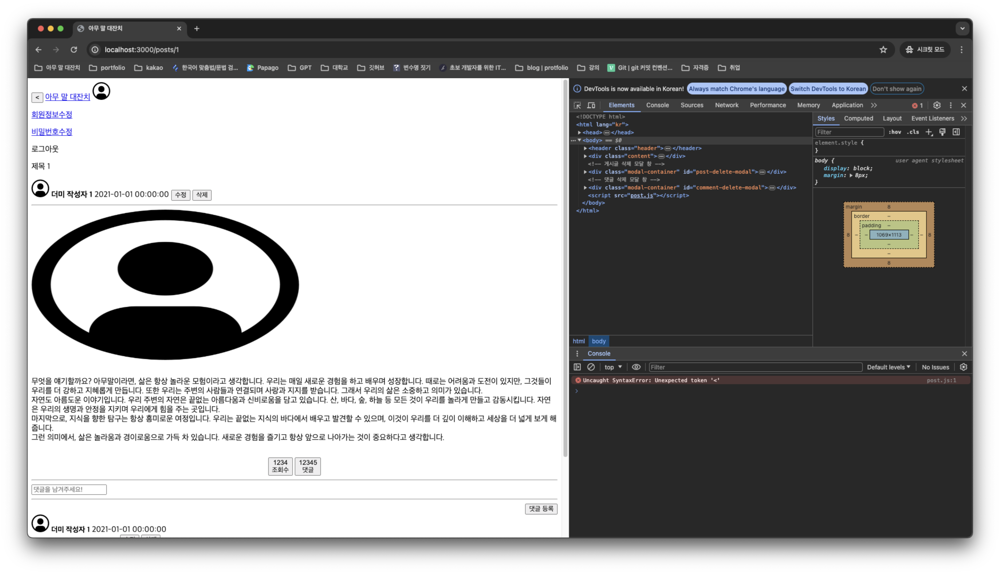
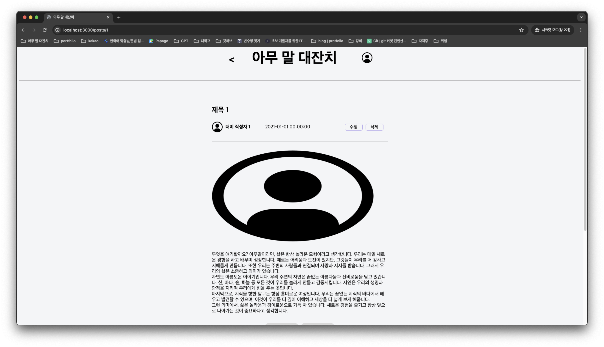

# Today I Learned

## 날짜: 2024-04-26

### 스크럼

- 학습 목표 1 : 2주차 2번 과제 수정

### 새로 배운 내용

#### 주제 1: 잘 쓰면 약, 못 쓰면 독, 경로 지정 이슈



posts.html에서 `location.href = /posts/${post.id};`('`' 있어요!, 마크다운 이슈) 통해 post.html 진입 과정에서 이슈가 발생했습니다. 크롬 개발자 도구 확인 결과 html, css, js를 받아왔음에도 css, js가 동작하지 않았습니다. 프로젝트 구조는 아래와 같습니다.

```txt
.
├── ...
├── public/
│   ├── ...
│   ├── post.css
│   ├── post.html
│   ├── post.js
│   ├── posts.css
│   ├── posts.html
│   └── posts.js
├── app.js
└── ...
```

9조 팀원들에게 자문했고, 논의를 통해 이슈의 원인이 css, js의 경로 문제임을 파악했습니다. 이슈가 발생한 html은 아래와 같습니다.

```html
<!doctype html>
<html lang="kr">
  <head>
    ...
    <link rel="stylesheet" type="text/css" href="post.css" />
    ...
  </head>

  <body>
    ...
    <script src="post.js"></script>
  </body>
</html>
```

웹 페이지 전달 express는 아래와 같습니다.

```js
app.use(express.static('public'));

app.get('/posts/:id', (request, response) => {
  response.sendFile(path.join(__dirname, '/public/post.html'));
});
```

json의 post id를 받고, 라우터를 통해 post.html을 전달, 브라우저의 URL은 `domain/psots/id`를 예상했습니다. 그러나 **절대 경로, 상대 경로 없이** css와 js을 연결해서 `location.href` 사용 시 경로가 꼬여 위와 같은 이슈를 만들었습니다. 해결 방법은 절대 경로 또는 상대 경로를 사용하는 것입니다. 수정된 html과 수정 결과는 아래와 같습니다.

```html
<!doctype html>
<html lang="kr">
  <head>
    ...
    <!-- 상대 경로 -->
    <link rel="stylesheet" type="text/css" href="/post.css" />
    ...
  </head>

  <body>
    ...
    <!-- 상대 경로 -->
    <script src="/post.js"></script>
  </body>
</html>
```



### 오늘의 도전 과제와 해결 방법

### 오늘의 회고

- 포기할까 여러 번 고민했는데 덕분에 해결할 수 있었습니다. hong, jade, jamie, kevin 항상 고마워요.

### 참고 자료 및 링크
