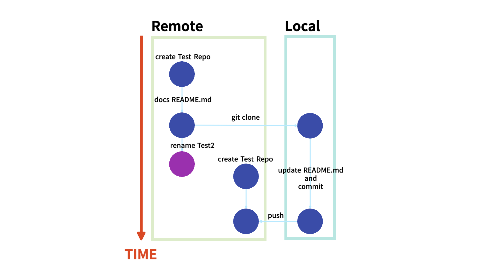

# Today I Learned

## 날짜: 2024-04-27

### 스크럼

### 새로 배운 내용

#### 주제 1: 그래서 저장소 이름 변경 후 upstream 설정은 왜 하는가?

깃허브 조직 저장소명 규칙이 생겨, 저장소 이름 변경이 필요했다. 깃허브 페이지에서 이름 변경 후 `git remote` 명령어를 통해 upstream 변경해야 한다고 알려주셨다. 과거 remote를 변경하지 않았음에도 정상적으로 외부 저장소에 저장된 기억이 있다. remote upstream을 변경하지 않으면 어떻게 될까?

직접 2개의 origin 저장소를 만들어 테스트해 보았고, 그에 대한 결과는 위 이미지와 같다. remote를 바르게 설정하지 않으면 다른 저장소에 저장되는 것을 확인할 수 있다.

### 오늘의 도전 과제와 해결 방법

### 오늘의 회고

- 깃 어려워잉

### 참고 자료 및 링크

- 이미지 출처: 나
