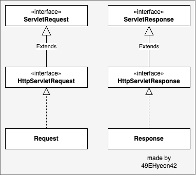

# Today I Learned

- 날짜: 2024-06-13

## Spring Boot Request, Response 생성 및 반환 디버깅

### 서론

스프링 필터를 만들고 있을 때, 어떤 필터는 ServletXxx, HttpServletXxx를 매개변수로 받는 것을 확인했다. 이는 무슨 차이인가?

```java
public class TestFilter implements Filter {

    @Override
    public void doFilter(ServletRequest servletRequest, ServletResponse servletResponse, FilterChain filterChain) throws IOException, ServletException {
        filterChain.doFilter(servletRequest, servletResponse);
    }
}
```

```java
public class TestFilter extends OncePerRequestFilter {

    @Override
    protected void doFilterInternal(HttpServletRequest httpServletRequest, HttpServletResponse httpServletResponse, FilterChain filterChain) throws ServletException, IOException {
        filterChain.doFilter(httpServletRequest, httpServletResponse);
    }
}
```

### 비교

1. `ServletRequest`, `ServletResponse` 인터페이스
    - 서블릿 컨테이너가 서블릿에 전달하는 요청 정보를 캡슐화하는 인터페이스
    - HTTP뿐만 아니라 다양한 프로토콜의 요청을 처리할 수 있도록 설계
        - 이론적으로는 다양한 프로토콜을 지원할 수 있지만, 실제 적용 사례는 대부분 HTTP에 국한
2. `HttpServletRequest`, `HttpServletResponse` 인터페이스
    - `ServletRequest`, `ServletResponse`의 확장이며 HTTP의 특정 기능을 추가로 제공



### 동작 과정 (간단)

> **`ValveBase` 추상 클래스**
>
> - Apache Tomcat의 파이프라인 구조에서 요청과 응답을 처리하기 위한 기본 클래스
> - 개발자가 이를 확장하여 사용자 정의 밸브를 구현할 수 있음
> - 스프링 프레임워크와 직접적인 관련은 없지만, Tomcat과 같은 서블릿 컨테이너와 함께 사용되는 경우, 스프링 애플리케이션의 요청 처리 흐름을 제어하는 데 유용

.

> **`StandardHostValve` 클래스**
>
> - 특정 호스트에 대한 요청을 적절한 웹 애플리케이션 컨텍스트에 전달
> - 동작 과정은 뒤에 후술

1. `ValveBase` 추상 클래스를 상속한 `StandardWrapperValve` 클래스가 `org.apache.catalina.connector.Request`의 `getRequest` 메서드를 호출해 Request 객체를 생성

    ```java
    public HttpServletRequest getRequest() {
        if (facade == null) {
            facade = new RequestFacade(this);
        }
        if (applicationRequest == null) {
            applicationRequest = facade;
        }
        return applicationRequest;
    }
    ```

2. 이후 같은 클래스에서 `org.apache.catalina.connector.Response`의 `getResponse` 메서드를 호출해 Response 객체를 생성

    ```java
    public HttpServletResponse getResponse() {
        if (facade == null) {
            facade = new ResponseFacade(this);
        }
        if (applicationResponse == null) {
            applicationResponse = facade;
        }
        return applicationResponse;
    }
    ```

### StandardHostValve 클래스 invoke() 메서드 동작 과정

1. 컨텍스트 선택
    - `request.getContext()`를 통해 컨텍스트를 찾는다. 만약 찾지 못하면 404 응답 후 종료

    ```java
    // Select the Context to be used for this Request
    Context context = request.getContext();
    if (context == null) {
        // Don't overwrite an existing error
        if (!response.isError()) {
            response.sendError(404);
            }
        return;
    }
    ```

2. 비동기 지원 설정
    - 비동기 지원 확인 후 요청의 비동기 지원 여부를 결정

    ```java
    if (request.isAsyncSupported()) {
        request.setAsyncSupported(context.getPipeline().isAsyncSupported());
    }
    ```

3. 초기화 이벤트 및 컨텍스트 바인딩
    - 요청의 비동기 처리 확인 후, 컨텍스트를 바인딩하고 요청 초기화 메서드 이벤트를 발생시킴
    - 비동기 처리가 아닌 경우, 초기화 이벤트가 발생

    ```java
    try {
        context.bind(Globals.IS_SECURITY_ENABLED, MY_CLASSLOADER);
    
        if (!asyncAtStart && !context.fireRequestInitEvent(request.getRequest())) {
            // Don't fire listeners during async processing (the listener
            // fired for the request that called startAsync()).
            // If a request init listener throws an exception, the request
            // is aborted.
            return;
        }
    ```

4. 컨텍스트에 요청 전달 및 예외 처리

    ```java
        // Ask this Context to process this request. Requests that are
        // already in error must have been routed here to check for
        // application defined error pages so DO NOT forward them to the
        // application for processing.
        try {
            if (!response.isErrorReportRequired()) {
                context.getPipeline().getFirst().invoke(request, response);
            }
        } catch (Throwable t) {
            ExceptionUtils.handleThrowable(t);
            container.getLogger().error(sm.getString("standardHostValve.exception", request.getRequestURI()), t);
            // If a new error occurred while trying to report a previous
            // error allow the original error to be reported.
            if (!response.isErrorReportRequired()) {
                request.setAttribute(RequestDispatcher.ERROR_EXCEPTION, t);
                throwable(request, response, t);
            }
        }
    ```

5. 서스펜션 해제

    > **서스펜션(suspension)**
    >
    > - Tomcat 및 서블릿 컨테이너의 맥락에서, 서스펜션은 주로 요청 및 응답 처리가 일시 중지되는 상태
    > - 비동기 처리는 요청을 즉시 처리하지 않고, 서블릿 스레드를 해제하여 다른 요청을 처리할 수 있도록 하는 기능
    >

    - 서스펜션 해제를 통해 요청/응답 쌍의 제어 복귀
    - 즉, 비동기 상태의 Response 객체를 컨테이너 요청 및 응답 처리를 완료할 수 있도록 한 것
    - 위 과정 후 컨테이너에 남아있는 데이터 또는 에러를 전달할 수 있는 상태가 됨

    ```java
        // Now that the request/response pair is back under container
        // control lift the suspension so that the error handling can
        // complete and/or the container can flush any remaining data
        response.setSuspended(false);
    ```

6. 예외 페이지 처리
    - 요청 중 발생한 예외를 확인 후 컨텍스트 상태가 유효한지 확인
    - 에러 보고가 필요하다면 에러 페이지로 렌더링

    ```java
        Throwable t = (Throwable) request.getAttribute(RequestDispatcher.ERROR_EXCEPTION);
    
        // Protect against NPEs if the context was destroyed during a
        // long running request.
        if (!context.getState().isAvailable()) {
            return;
        }
    
        // Look for (and render if found) an application level error page
        if (response.isErrorReportRequired()) {
            // If an error has occurred that prevents further I/O, don't waste time
            // producing an error report that will never be read
            AtomicBoolean result = new AtomicBoolean(false);
            response.getCoyoteResponse().action(ActionCode.IS_IO_ALLOWED, result);
            if (result.get()) {
                if (t != null) {
                    throwable(request, response, t);
                } else {
                    status(request, response);
                }
            }
        }
    ```

7. 요청 완료 및 정리

    ```java
        if (!request.isAsync() && !asyncAtStart) {
            context.fireRequestDestroyEvent(request.getRequest());
        }
    } finally {
        // Access a session (if present) to update last accessed time, based
        // on a strict interpretation of the specification
        if (context.getAlwaysAccessSession()) {
            request.getSession(false);
        }
    
        context.unbind(Globals.IS_SECURITY_ENABLED, MY_CLASSLOADER);
    }
    ```

### Request, Response 생성 부터 반환까지의 가정

> **알림**
>
> 1. 예외 없이 정상적으로 동작한다고 가정한다.
> 2. 전체 동작 과정이 아니다, 상세 내용은 디버깅으로 확인하자.

1. `CoyoteAdapter` 클래스
    1. `StandardEngineValve` 클래스
        1. `StandardHostValve` 클래스
        2. `StandardHostValve` 클래스의 `invoke()` 메서드 중 `context.getPipeline().getFirst().invoke(request, response);`를 통해 다른 파이프 라인 클래스로 이동
            1. `StandardWrapperValve` 클래스
            2. `StandardContextValve` 클래스
            3. `AuthenticatorBase` 클래스
    2. `StandardHostValve`클래스의 `invoke()` 나머지 동작
    3. `ErrorReportValve` 클래스
2. `CoyoteAdapter` 클래스의 `service()` 메서드 중 `response.finishResponse();`에서 응답 반환
3. `CoyoteAdapter` 클래스의 `service()` 메서드 중 `request.recycle();`, `response.recycle();`를 통해 재사용할 수 있도록 초기화

## 오늘의 회고

어렵다..

## 참고 자료 및 링크

- debugging & ChatGPT
- [Servlet이 httprequest를 HttpServletRequest로 만드는 과정](https://www.inflearn.com/questions/297537/servlet%EC%9D%B4-httprequest%EB%A5%BC-httpservletrequest%EB%A1%9C-%EB%A7%8C%EB%93%9C%EB%8A%94-%EA%B3%BC%EC%A0%95)
