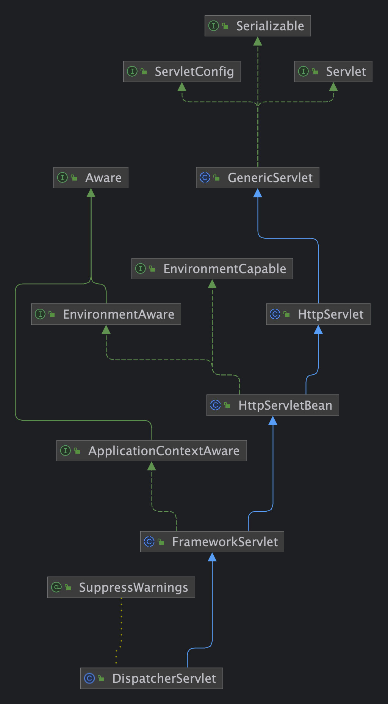
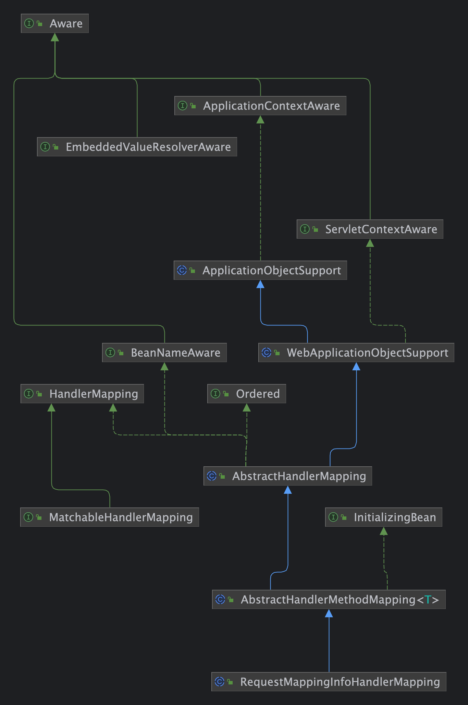
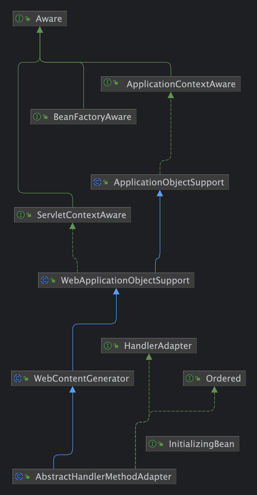
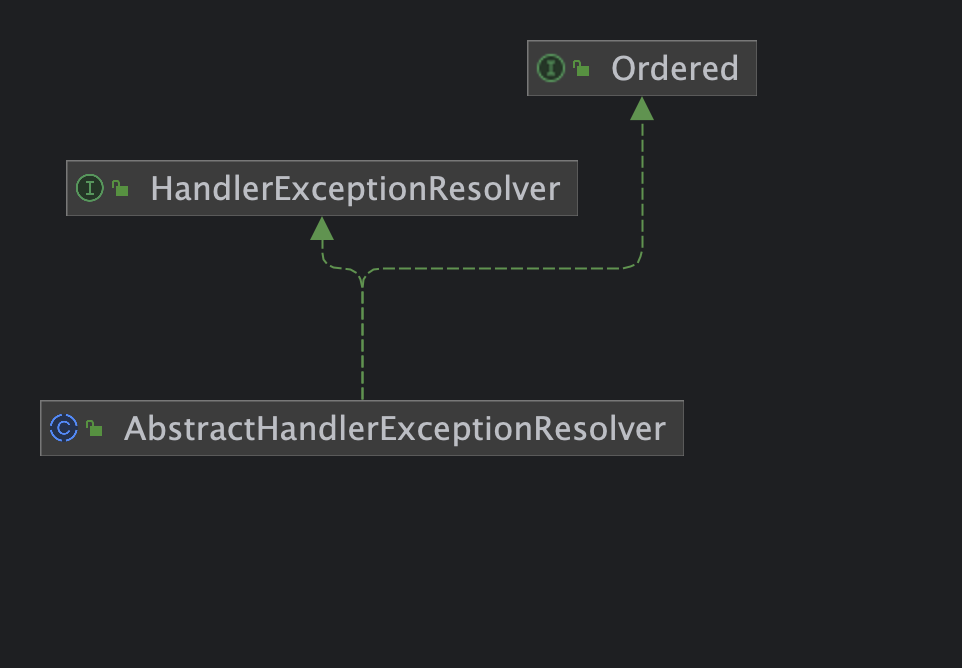
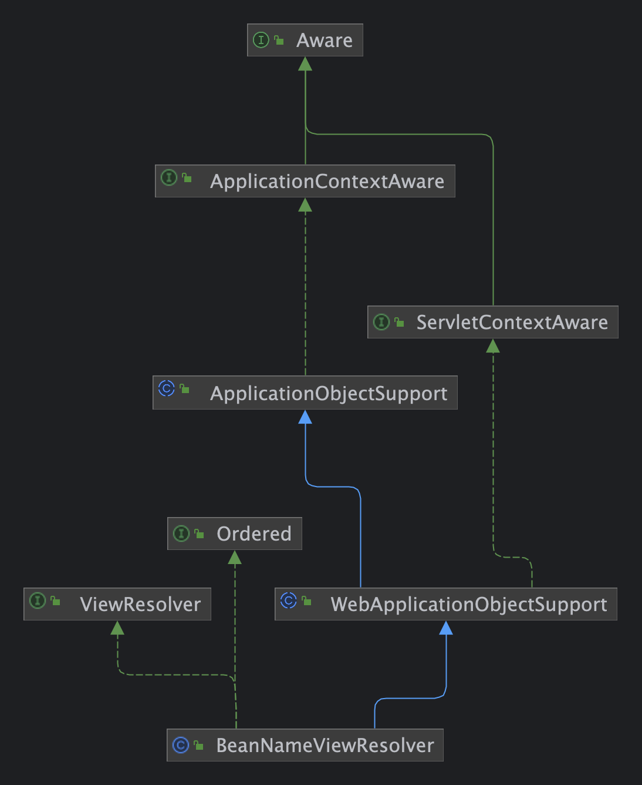
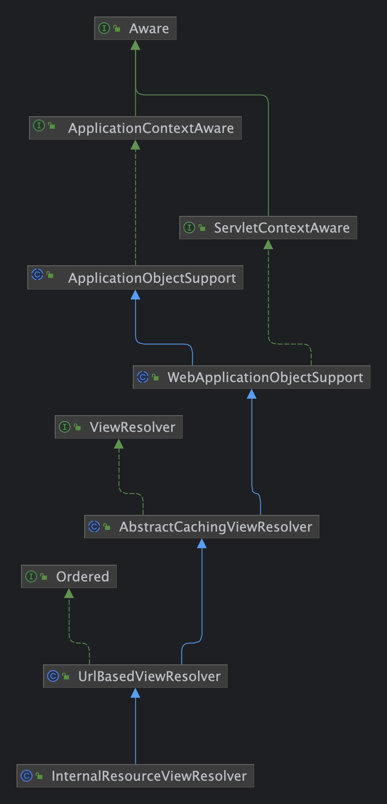

# Today I Learned

- 날짜: 2024-06-20

## Spring Boot, Dispatcher Servlet 구성, 동작 맛보기

### DispatcherServlet의 주요 구성 요소

1. `HandlerMapping`
    - 요청 URL을 적절한 핸들러 메서드에 매핑하는 역할
    - `RequestMappingHandlerMapping`은 `@RequestMapping` 어노테이션을 기반으로 매핑을 처리
2. `HandlerAdapter`
    - 매핑된 핸들러를 실행하는 역할
    - `RequestMappingHandlerAdapter`는 `@RequestMapping`이 붙은 메서드를 실행하는 대표적인 `HandlerAdapter`
3. `HandlerExceptionResolver`
    - 요청 처리 중에 발생한 예외를 처리하는 역할
    - 예외가 발생하면 적절한 예외 처리 로직을 수행하고, 이에 따른 응답을 생성
4. `ViewResolver`
    - 뷰 이름을 실제 뷰 객체로 변환하는 역할
    - 예를 들어, `InternalResourceViewResolver`는 JSP 파일을 뷰로 사용

### DispatcherServlet 간단 동작 흐름

1. 요청 수신: 클라이언트 요청이 `DispatcherServlet`에 도달
2. 핸들러 탐색: `HandlerMapping`을 통해 요청을 처리할 핸들러 탐색
3. 핸들러 실행: `HandlerAdapter`를 통해 핸들러 메서드를 실행
4. 예외 처리: `HandlerExceptionResolver`를 통해 예외 처리
5. 뷰 처리: `ViewResolver`를 통해 뷰를 찾고 렌더링
6. 모델과 뷰: 핸들러가 `ModelAndView` 객체를 반환
7. 응답 반환

### Dispatcher Servlet 관련 다이어그램

1. `DispatcherServlet`
    
2. `RequestMappingHandlerMapping`
    
3. `RequestMappingHandlerAdapter`
    
4. `DefaultHandlerExceptionResolver`
    
5. `BeanNameViewResolver`, `InternalResourceViewResolver`
    
    

### Q. 인터셉터는 어디 라인 이후에 접근하는 걸까?

`doDispatch()` 메서드의 아래 코드에서 인터셉터에 접근하는 것을 확인했다.

```java
if (!mappedHandler.applyPreHandle(processedRequest, response)) {
    return;
}
```

`mappedHandler.applyPreHandle()`을 조금 더 살펴보자.

```java
boolean applyPreHandle(HttpServletRequest request, HttpServletResponse response) throws Exception {
    for (int i = 0; i < this.interceptorList.size(); i++) {
        HandlerInterceptor interceptor = this.interceptorList.get(i);
        if (!interceptor.preHandle(request, response, this.handler)) {
            triggerAfterCompletion(request, response, null);
            return false;
        }
    this.interceptorIndex = i;
    }
    return true;
}
```

인터셉터 리스트에서 `preHandle()` 메서드를 호출한다. 여러 인터셉터의 `preHandle()` 중 하나라도 `false`를 반환하면 `false`를 반환하는 코드를 볼 수 있다.

또한 인터셉터를 확인하는 코드보다 실제 핸들러를 호출하는 부분이 밑에 있는 것을 확인할 수 있다.

```java
if (!mappedHandler.applyPreHandle(processedRequest, response)) {
    return;
}

// Actually invoke the handler.
mv = ha.handle(processedRequest, response, mappedHandler.getHandler());
```

**즉, 인터셉터를 먼저 확인하고, 실제 핸들러를 호출(확인)하기 때문에 요청에 해당하는 핸들러(URL, Method)가 없어도 인터셉터에 진입하는 것을 알 수 있다.**

### Q. 예외 동작은 어떻게..?

`doDispatch()`에서 예외 발생 시 `processDispatchResult()` 메서드를 호출하고, 내부적으로 `processHandlerException()`을 호출하는 것을 볼 수 있다.

```java
// doDispatch() 메서드 중
processDispatchResult(processedRequest, response, mappedHandler, mv, dispatchException);
```

```java
// processDispatchResult() 메서드 중
mv = processHandlerException(request, response, handler, exception);
```

`processHandlerException()` 메서드 내부에서 `HandlerExceptionResolver`가 담긴 리스트를 통해 예외에 해당되는 리졸버를 탐색하는 로직을 확인할 수 있다.

```java
// processHandlerException() 메서드 중

// 생략

// Check registered HandlerExceptionResolvers...
ModelAndView exMv = null;
if (this.handlerExceptionResolvers != null) {
    for (HandlerExceptionResolver resolver : this.handlerExceptionResolvers) {
        exMv = resolver.resolveException(request, response, handler, ex);
        if (exMv != null) {
            break;
        }
    }
}

// 생략
```

위와 같은 로직을 통해 어떻게 `HandlerExceptionResolver`로 해당되는 예외를 처리하는지 살펴봤다.

### Q. 컨트롤러단에서 예외가 발생한다면?

컨트롤러에서 에러가 발생하면 `doDispatch()`의 실제 핸들러를 호출하는 부분까지 전파하고, try-catch로 잡아내는 모습을 볼 수 있었다.

```java
// 예외 발생!
// Actually invoke the handler.
mv = ha.handle(processedRequest, response, mappedHandler.getHandler());
```

만약 아래와 같이 컨트롤러에 예외 핸들러가 있으면 어떻게 될까?

```java
// 컨트롤러 중

@GetMapping("/api/method")
public void method() {
    throw new RuntimeException();
}

@ExceptionHandler(RuntimeException.class)
public ResponseEntity<Void> handleRuntimeException(RuntimeException exception) {
    // 확인을 위해 200 사용
    return ResponseEntity.status(200).build();
}
```

이전 `HandlerExceptionResolver` 검사 로직에서 (여러 추가적인 과정을 거친 후) 컨트롤러의 예외 핸들러로 접근하는 모습을 볼 수 있었다.

## 오늘의 회고

노력 중 ...

## 참고 자료 및 링크
