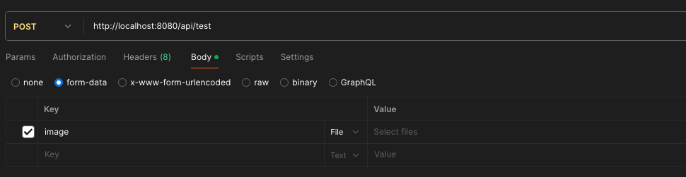
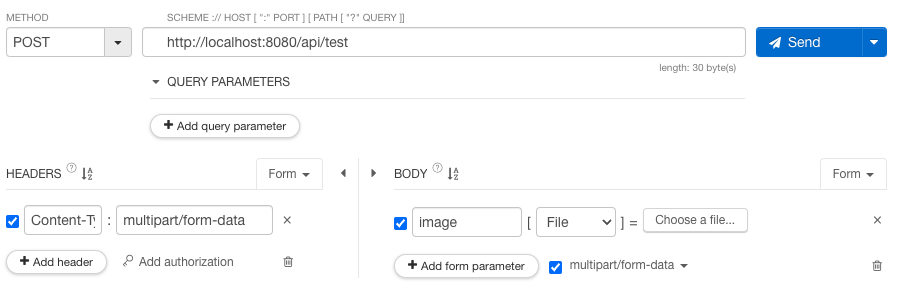

# Today I Learned

- 날짜: 2024-06-24

## Spring Boot, MultipartFile 유효성 검사

### 1. 서론

과제 수행 중 이미지를 `@RequestPart` 또는 `@ModelAttribute`를 통해 파일을 받고, 유효성 검사 과정에서 문제가 발생했다. 해당 파일은 이미지 파일이며, 없거나 한 개의 파일을 보낼 수 있다. `@RequestPart`를 사용한 예제는 다음과 같다.

```java
@RestController
public class TestController {

    private static final Logger log = LoggerFactory.getLogger(MemberController.class);

    @PostMapping("/api/test")
    public void MultipartFileTestMethod(@RequestPart(value = "image") MultipartFile image) {
        log.info("image: {}", image);

        if (image != null) {
            log.info("image: {}", image.getOriginalFilename());
        }
    }
}
```

해당 이미지 파일은 없을 수도 있기 때문에 `null`이 매개변수로 들어올 수 있다.

```bash
# 요청
curl -X POST http://localhost:8080/api/test
```

```txt
# 로그
image: null
```

그러나 객체는 있고 파일이 없는 경우도 존재한다. 대표적으로 Postman과 Talend API Tester에서 Body를 form-data 설정 후 Key에는 image, Value는 공백으로 두는 경우이다.





`curl` 명령어는 요청은 실패했다. ~~안되네..~~

```bash
# 요청
curl -F "image=@" http://localhost:8080/api/test

# 실패
curl: (26) Failed to open/read local data from file/application

# 재요청
curl -F "image=@\"\"" http://localhost:8080/api/test

# 실패
curl: (26) Failed to open/read local data from file/application
```

위 문제를 포함해 3가지의 예제 코드를 만들어보려 한다.

1. `null`을 허용하지 않을 때 공백으로 들어온 경우
2. 파일 개수 유효성 검사
3. 파일 확장자 유효성 검사

### 2. null을 허용하지 않을 때 공백으로 들어온 경우

#### 2-1. 예제

```java
public class TestRequest {

    @NotNull
    private final MultipartFile file;

    public TestRequest(MultipartFile file) {
        this.file = file;
    }

    public MultipartFile getFile() {
        return file;
    }
}
```

```java
@RestController
public class TestController {

    private static final Logger log = LoggerFactory.getLogger(TestController.class);

    @PostMapping("/api/test")
    public void MultipartFileTestMethod(@Valid TestRequest testRequest) {
        log.info("file: {}", testRequest.getFile());
        log.info("file name: {}", testRequest.getFile().getOriginalFilename());
    }
}
```

다음과 같이 `null`을 허용하지 않는 `MultipartFile`을 매개변수로 받는 컨트롤러가 있다고 가정하자. 헤더에 `Content-Type: multipart/form-data`가 명시되어 있지 않거나, `Body`에 `file`이라는 `Key`가 없는 경우, `null` 값이 들어오게 된다. 이후 `@NotNull` 어노테이션을 통해 컨트롤러에 진입하지 않고, 클라이언트에게 400 응답을 전달한다. 파일은 없지만 유효성 검사를 통과하는 모습을 볼 수 있다.

```txt
# 로그
file: org.springframework.web.multipart.support.StandardMultipartHttpServletRequest$StandardMultipartFile@생략
file name:
```

**`@NotEmpty`, `@NotBlank`는 문자열이 아니기 때문에 사용할 수 없다. 즉, Spring Boot에서 제공하는 Validation으로 `MultipartFile` 객체의 유효성을 검사할 수 없다.**

#### 2-2. 해결

역시 스프링은 해당 문제에 대한 기능을 제공한다. 어노테이션과 `ConstraintValidator`의 구현체를 통해 사용자가 정의한 유효성 검사를 수행할 수 있다. 아래는 `MultipartFile`이 `null` 또는 공백의 경우 유효성 검사에 실패하는 코드이다.

```java
@Target({ElementType.FIELD, ElementType.PARAMETER})
@Retention(RetentionPolicy.RUNTIME)
@Constraint(validatedBy = FileConstraintValidator.class)
public @interface File {

    // validation에 적용된 기본 메시지를 참고해 메시지를 넣었다.
    String message() default "must not be null or empty";

    Class<?>[] groups() default {};

    Class<? extends Payload>[] payload() default {};
}
```

```java
public class FileConstraintValidator implements ConstraintValidator<File, MultipartFile> {

    @Override
    public boolean isValid(MultipartFile multipartFile, ConstraintValidatorContext constraintValidatorContext) {
        return multipartFile != null && !multipartFile.isEmpty();
    }
}
```

이제 문제가 되었던 `@NotNull` 대신 직접 만든 `@File`을 사용하자.

```java
public class TestRequest {

    @File
    private final MultipartFile file;

    public TestRequest(MultipartFile file) {
        this.file = file;
    }

    public MultipartFile getFile() {
        return file;
    }
}
```

```java
@RestController
public class TestController {

    private static final Logger log = LoggerFactory.getLogger(TestController.class);

    @PostMapping("/api/test")
    public void MultipartFileTestMethod(@Valid TestRequest testRequest) {
        log.info("file: {}", testRequest.getFile());

        if (testRequest.getFile() != null) {
            log.info("file name: {}", testRequest.getFile().getOriginalFilename());
        }
    }
}
```

### 3. 파일 개수 유효성 검사

2번 `null`을 허용하지 않을 때 공백으로 들어온 경우의 연장선이다. 이것에 대한 구현은 `@Size`의 `ConstraintValidator` 구현체인 `SizeValidatorForCharSequence` 클래스를 참고했다.

```java
@Target({ElementType.FIELD, ElementType.PARAMETER})
@Retention(RetentionPolicy.RUNTIME)
@Constraint(validatedBy = FilesConstraintValidator.class)
public @interface Files {

    // message 뭐라고 하지
    String message() default "size must be between {min} and {max}";

    Class<?>[] groups() default {};

    Class<? extends Payload>[] payload() default {};

    int min() default 0;

    int max() default 10;
}
```

```java
public class FilessConstraintValidator implements ConstraintValidator<Files, Collection<MultipartFile>> {

    private static final Log LOG = LoggerFactory.make(MethodHandles.lookup());

    private int min;
    private int max;

    @Override
    public void initialize(Files constraintAnnotation) {
        min = constraintAnnotation.min();
        max = constraintAnnotation.max();
        validateParameters();
    }

    private void validateParameters() {
        if (min < 0) {
            throw LOG.getMinCannotBeNegativeException();
        } else if (max < 0) {
            throw LOG.getMaxCannotBeNegativeException();
        } else if (max < min) {
            throw LOG.getLengthCannotBeNegativeException();
        }
    }

    @Override
    public boolean isValid(Collection<MultipartFile> files, ConstraintValidatorContext constraintValidatorContext) {
        if (files == null || files.isEmpty()) {
            return false;
        }
        
        // 사실 여기서 추가적인 검사가 필요하다.
        //  - 파일이 null 또는 공백인 경우
        //  - 올바른 파일이 맞는지 등...

        return min <= files.size() && files.size() <= max;
    }
}
```

```java
public class TestRequest {

    @Files
    private final Collection<MultipartFile> files;

    public TestRequest(Collection<MultipartFile> files) {
        this.files = files;
    }

    public Collection<MultipartFile> getFiles() {
        return files;
    }
}
```

```java
@RestController
public class TestController {

    private static final Logger log = LoggerFactory.getLogger(TestController.class);

    @PostMapping("/api/test")
    public void MultipartFileTestMethod(@Valid TestRequest testRequest) {
        for (MultipartFile file : testRequest.getFiles()) {
            log.info("file: {}", file);
            log.info("file name: {}", file.getOriginalFilename());
        }
    }
}
```

### 4. 파일 확장자 유효성 검사

파일이 없다면 유효성 검사를 하지 않고, 통과시킨다. 적용 예시는 생략하겠다.

```java
@Target({ElementType.FIELD, ElementType.PARAMETER})
@Retention(RetentionPolicy.RUNTIME)
@Constraint(validatedBy = FileExtensionsConstraintValidator.class)
public @interface FileExtensions {

    String message() default "must be a allowed extension";

    Class<?>[] groups() default {};

    Class<? extends Payload>[] payload() default {};

    String[] value() default {"bmp", "jpeg", "jpg", "png", "svg", "webp"};
}
```

```java
public class FileExtensionsConstraintValidator implements ConstraintValidator<FileExtensions, MultipartFile> {

    private String[] allowedExtensions;

    @Override
    public void initialize(FileExtensions constraintAnnotation) {
        // 없어도 되지만 사용자를 믿으면 안된다.
        allowedExtensions = Arrays.stream(constraintAnnotation.value())
                .map(String::toLowerCase)
                .toArray(String[]::new);
    }

    @Override
    public boolean isValid(MultipartFile multipartFile, ConstraintValidatorContext constraintValidatorContext) {
        if (multipartFile == null || multipartFile.isEmpty()) {
            return true;
        }

        String fileName = multipartFile.getOriginalFilename();

        if (fileName == null || fileName.isBlank()) {
            return false;
        }

        String extension = fileName.substring(fileName.lastIndexOf(".") + 1).toLowerCase();

        for (String allowedExtension : allowedExtensions) {
            if (extension.equals(allowedExtension)) {
                return true;
            }
        }

        return false;
    }
}
```

### 5. 아무 말 대 잔치 실제 적용

아무 말 대잔치 프로젝트에서 `MultipartFile` 유효성 검사에 대한 문제점은 2가지다.

1. `MultipartFile` 객체는 있으나 공백인 경우
2. 확장자에 따른 유효성 검사를 수행할 수 없음

아무 말 대잔치 프로젝트에서 이미지를 받는 경우는 아래와 같다.

1. 회원가입 (필수)
2. 프로필 수정 (필수)
3. 게시글 추가 (선택)
4. 게시글 수정 (선택)

위 경우와 지금까지 만든 예제 코드를 바탕으로 커스텀한 유효성 검사 어노테이션을 만들려고 한다.

#### 5-1. @NotEmptyFile

이미지가 필수인 경우 `@NotEmptyFile`을 사용하려고 한다. `@NotNullFile`이라는 이름과 고민했지만, 객체는 있고, 공백이 있는 경우가 있기 때문에 `@NotEmptyFile`로 이름 지었다. “2번 null을 허용하지 않을 때 공백으로 들어온 경우”와 동일한 로직이다.

```java
@Target({ElementType.FIELD, ElementType.PARAMETER})
@Retention(RetentionPolicy.RUNTIME)
@Constraint(validatedBy = NotEmptyFileConstraintValidator.class)
public @interface NotEmptyFile {

    String message() default "must not be null or empty";

    Class<?>[] groups() default {};

    Class<? extends Payload>[] payload() default {};
}
```

```java
public class NotEmptyFileConstraintValidator implements ConstraintValidator<NotEmptyFile, MultipartFile> {

    @Override
    public boolean isValid(MultipartFile multipartFile, ConstraintValidatorContext constraintValidatorContext) {
        return multipartFile != null && !multipartFile.isEmpty();
    }
}
```

#### 5-2. @FileExtensions

4번 파일 확장자 유효성 검사와 동일하므로 생략한다.

#### 5-3. 적용

이미지가 필수인 경우 아래와 같이 사용한다.

```java
public class TestRequest {

    @NotEmptyFile
    @FileExtensions
    private final MultipartFile file;

    // 생략
}
```

이미지가 필수가 아닌 경우 아래와 같이 사용한다.

```java
public class TestRequest {

    @FileExtensions
    private final MultipartFile file;

    // 생략
}
```

### 6. etc

- 1개만 받을 수 있는 상황에서 클라이언트가 다수의 파일을 보내면 가장 처음 파일만 받는다.
- 자바 `record` 클래스도 사용할 수 있다.

    ```java
    public record TestRequest(@NotEmptyFile @FileExtensions MultipartFile file) {
    
    }
    ```

## 오늘의 회고

노력 중 ...

## 참고 자료 및 링크

- debugging & ChatGPT
- [Spring Docs: Java Bean Validation#Configure Custom Constraints](https://docs.spring.io/spring-framework/reference/core/validation/beanvalidation.html#validation-beanvalidation-spring-constraints)
- [Baeldung: Spring MVC Custom Validation](https://www.baeldung.com/spring-mvc-custom-validator)
