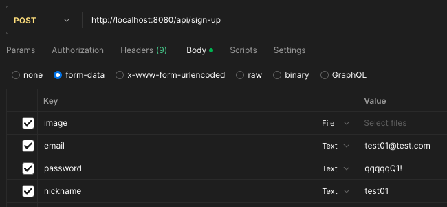
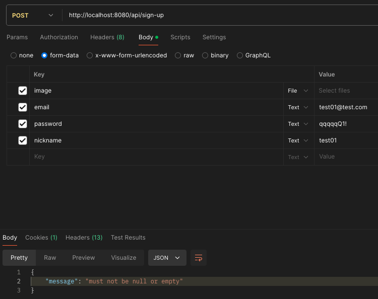

# Today I Learned

- 날짜: 2024-06-25

## Spring Boot, MultipartFile 유효성 검사 직렬화 이슈

### 1. 서론

`@NotEmptyFile`, `@FileExtensions` 어노테이션 사용과 상관없이 image Key는있지만 Value가 공백인 경우 예외가 발생한다.



```txt
com.fasterxml.jackson.databind.exc.InvalidDefinitionException: No serializer found for class java.io.ByteArrayInputStream and no properties discovered to create BeanSerializer (to avoid exception, disable SerializationFeature.FAIL_ON_EMPTY_BEANS) (through reference chain: java.util.LinkedHashMap["errors"]->java.util.Collections$UnmodifiableRandomAccessList[0]->org.springframework.validation.beanvalidation.SpringValidatorAdapter$ViolationFieldError["rejectedValue"]->org.springframework.web.multipart.support.StandardMultipartHttpServletRequest$StandardMultipartFile["inputStream"])
```

해당 예외는 유효성 검사는 통과하지만, 응답을 위한 JSON 직렬화 중 발생한 예외이기 때문에 클라이언트에 응답이 가지 않는다. 이는 높은 수준의 심각도를 가지고 있다.

### 2. 디버깅

우선 image Key가 없는 경우, 아래와 같은 기본 응답을 클라이언트에게 전달하는 것을 알아두자.

```json
{
    "timestamp": "생략",
    "status": 400,
    "error": "Bad Request",
    "trace": "org.springframework.web.bind.MethodArgumentNotValidException: 생략",
    "message": "Validation failed for object='signUpRequest'. Error count: 1",
    "errors": [
        {
            "codes": [
                "NotEmptyFile.signUpRequest.image",
                "NotEmptyFile.image",
                "NotEmptyFile.org.springframework.web.multipart.MultipartFile",
                "NotEmptyFile"
            ],
            "arguments": [
                {
                    "codes": [
                        "signUpRequest.image",
                        "image"
                    ],
                    "arguments": null,
                    "defaultMessage": "image",
                    "code": "image"
                }
            ],
            "defaultMessage": "must not be null or empty",
            "objectName": "signUpRequest",
            "field": "image",
            "rejectedValue": null,
            "bindingFailure": false,
            "code": "NotEmptyFile"
        }
    ],
    "path": "/api/sign-up"
}
```

디버깅 진행 결과, `BeanSerializerBase` 클래스의 `serializeFields()` 메서드에서 “rejectedValue” 필드의 `ByteArrayInputStream` 직렬화 중 `Exception`이 발생하는 것을 확인했다.

```java
try {
    for (final int len = props.length; i < len; ++i) {
        BeanPropertyWriter prop = props[i];
        if (prop != null) { // can have nulls in filtered list
            prop.serializeAsField(bean, gen, provider);
        }
    }
    if (_anyGetterWriter != null) {
        _anyGetterWriter.getAndSerialize(bean, gen, provider);
    }
} catch (Exception e) {
    String name = (i == props.length) ? "[anySetter]" : props[i].getName();
    wrapAndThrow(provider, e, bean, name);
}
```

해당 예외는 `InvalidDefinitionException`이며 아래와 같은 메시지를 담고 있다.

```txt
No serializer found for class java.io.ByteArrayInputStream and no properties discovered to create BeanSerializer (to avoid exception, disable SerializationFeature.FAIL_ON_EMPTY_BEANS)
```

예외가 시프링 시큐리티 필터처럼 다른 `Serializer` 클래스에 전달되고, `AbstractJackson2HttpMessageConverter` 클래스의 `writeInternal()` 메서드에서 `HttpMessageConversionException`으로 감싸는 모습을 볼 수 있었다.

```java
catch (InvalidDefinitionException ex) {
    throw new HttpMessageConversionException("Type definition error: " + ex.getType(), ex);
}
```

마지막으로 `HttpMessageConversionException`이 `DispatcherServlet` 클래스까지 예외가 전파되는 것을 확인했다.

`DispatcherServlet` 클래스 이후 과정을 간략하게 요약하면 서버에서 응답을 전달하지 않고, 소켓을 끊는 모습을 볼 수 있었다. (이 부분은 너무 깊어서 맞는지 틀린지 모르겠다)

### 3. 해결 과정

#### 3-1. @JsonIgnore 사용, 실패

첫 번째 방법은 필드에 `@JsonIgnore`을 사용하는 방법이다.

```java
public record UpdateMemberImageAndNicknameRequest(
    @NotEmptyFile @FileExtensions @JsonIgnore MultipartFile image,
    @NotBlank @Size(min = 1, max = 10) String nickname) {
}
```

아쉽지만 동일한 예외가 발생한다. `@JsonIgnore`을 무시하고 접근하는 듯하다.

#### 3-2. fail-on-empty-beans: false, 실패

Jackson에서 JSON 직렬화 중 빈 객체(속성이 없는 객체)를 직렬화할 때 예외를 발생시킨다. 기본값는 `true`다, 이를 `false`로 설정한다면 해결할 수 있지 않을까?

```yaml
spring:
  jackson:
    serialization:
      fail-on-empty-beans: false
```

이 해결책 또한 클라이언트에게 응답을 주지 않고 아래의 예외를 발생한다.

```txt
java.io.FileNotFoundException: MultipartFile resource [image] cannot be resolved to absolute file path
```

#### 3-3. 예외 핸들러 처리, 성공

이 문제의 본질은 기본 예외 처리 중 직렬화의 실패다. 그렇다면 기본 예외 처리를 사용하지 않는다면 어떨까?

```java
@RestControllerAdvice
public class GlobalExceptionHandler {

    @ExceptionHandler(MethodArgumentNotValidException.class)
    public ResponseEntity<ErrorResponse> handleMethodArgumentNotValidException(MethodArgumentNotValidException exception) {
        return ResponseEntity.badRequest().body(new ErrorResponse(exception.getBindingResult().getAllErrors().get(0).getDefaultMessage()));
    }
}
```



성공하는 모습을 볼 수 있다.

위 방법을 사용하는 것도 좋지만, 예외 핸들러 없이 기본 응답을 사용하는 방법을 아직 발견하지 못했다.

## 오늘의 회고

노력 중 ...

## 참고 자료 및 링크

- debugging & ChatGPT
