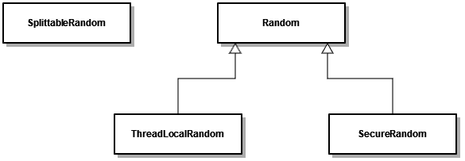

# Today I Learned

- 날짜: 2024-05-24

## 자바 11 vs 17

저는 주로 자바 11버전을 사용해 왔습니다. KCS 강의에서 자바 17버전을 사용하는 것을 보고, 마이그레이션하기 위해 추가된 점, 변경 점을 정리했습니다.

> [주의]
>
> 이 TIL은 모든 변경 점을 담지 않았습니다, 자세한 사항은 [링크](https://openjdk.org/projects/jdk/17/jeps-since-jdk-11)를 참고하세요.

### Pattern Matching for instanceof

before

```java
public class PatternMatchingExample {
    public static void main(String[] args) {
        Object obj = "Hello, World!";

        if (obj instanceof String) {
            String str = (String) obj;
            System.out.println(str.toUpperCase());
        }
    }
}
```

after

```java
public class PatternMatchingExample {
    public static void main(String[] args) {
        Object obj = "Hello, World!";

        if (obj instanceof String str) {
            // 타입 변환 없음
            System.out.println(str.toUpperCase());
        }
    }
}
```

### Record

자바 14에 preview로 공개되었고, 자바 16에 정식 기능으로 채택된 특별한 class이다. record는 주로 데이터를 저장하기 위한 불변 객체를 간결하게 정의하는 데 사용된다. 아래와 같이 사용할 수 있다.

```java
public record PersonRecord(String name, int age) {
}
```

```java
public class Main {

    public static void main(String[] args) {
        // 1. Constructor
        // - 모든 필드에 대한 파라미터가 있는 생성자 자동 생성
        PersonRecord personRecord = new PersonRecord("noah.jo", 0);

        // 2, Getter
        // - 모든 필드에 대한 getter 자동 생성, 메소드명 주의
        System.out.println("name: " + personRecord.name());
        System.out.println("age: " + personRecord.age());

        // 3. equals()
        // - 모든 필드가 같으면 같은 객체로 판단
        System.out.println("equals(): " + personRecord.equals(new PersonRecord("noah.jo", 0)));

        // 4. hashcode()
        // - 모든 필드가 같으면 같은 값을 반환
        System.out.println("hashcode(): " + (personRecord.hashCode() == new PersonRecord("noah.jo", 0).hashCode()));

        // 5. toString()
        // - "클래스명@해스코드"가 아닌 클래스명[필드명=값, ...] 출력
        System.out.println(personRecord);
    }
}
```

`record`는 기본적으로 다음과 같은 기능을 자동으로 제공함으로써 boilerplate code를 줄일 수 있다.

- 모든 필드를 초기화하는 파라미터가 있는 생성자
- 모든 필드에 대한 getter 메서드
- **`equals()`**, **`hashCode()`**, **`toString()`** 메서드

위 예시에는 없지만 커스텀 생성자와 메서드를 정의할 수 있다. `record`를 통해 개발 생산성을 높일 수 있지만 아래와 같은 주의가 필요하다.

- `record`는 `abstract` 일 수 없다.
- `record`는 `final`이 암시적으로 선언되었기 때문에 상속할 수 없고, `extends`를 사용할 수 없기 때문에 상속받을 수 없다.
- `record`를 통해 인터페이스를 구현할 수 있다.
- `record`는 최상위 레벨로 선언되거나 중첩 클래스로 사용할 수 있다.
  - 최상위 레벨: 패키지 단에서 직접 선언
- `record`는 제네릭 타입을 사용할 수 있다.

    ```java
    public record PersonRecord<T>(T data) {
    }
    ```

- `record`의 필드 값은 불변한다. 인스턴스를 생성한 후에는 필드 값을 변경할 수 없다. 만약 필드 값을 변경해야 한다면, 새로운 `record` 인스턴스를 생성해야 한다.

### Sealed Classes

클래스 계층 구조를 더 안전하고 명확하게 정의할 수 있도록 도와주는 기능, 클래스가 어떤 클래스에 의해 상속될 수 있는지를 명시적으로 제한할 수 있게 한다. `sealed` 예약어를 사용했을 때의 장점은 아래와 같다.

- 명확한 클래스 계층 구조
- 유지보수성 향상
- 보안 및 안전성 증가

사용 예시는 아래와 같다.

```java
public sealed class Shape permits Circle, Rectangle, Square {
}

public final class Circle extends Shape {
}

public final class Rectangle extends Shape {
}

public final class Square extends Shape {
}
```

`sealed` 클래스를 상속한 클래스는 `final`, `sealed` 또는 `non-sealed`를 선언해야 한다.

- `final`: 더 이상 상속할 수 없음
- `sealed`: 상속할 수 있지만, 상속할 수 있는 클래스 제한
- `non-sealed`: 상속 제한 해제

또한 인터페이스에서도 `sealed` 예약어를 사용할 수 있다.

```java
public sealed interface Shape permits Circle, Rectangle, Square {
    double area();
}
```

### Switch Expression

자바 14에 채택된 기능이다.

```java
String dayName = switch (day) {
    case 1 -> "Monday";
    case 2 -> "Tuesday";
    case 3 -> {
        System.out.println("Processing Wednesday");
        yield "Wednesday";
    }
    case 4 -> "Thursday";
    case 5 -> "Friday";
    case 6 -> "Saturday";
    case 7 -> "Sunday";
    default -> throw new IllegalArgumentException("Invalid day: " + day);
};
```

- `case` 내부적으로 `break`를 포함하므로, `break`를 작성할 필요 없음
- `yield`: 스위치 중괄호 내에서 값을 반환하기 위해 사용

### Text Block

자바 15에 채택된 기능이다.

```java
public class TextBlockExample {
    public static void main(String[] args) {
        String textBlock = """
                This is a text block.
                It can span multiple lines.
                Indentation is handled automatically.
                """;

        System.out.println(textBlock);
    }
}
```

### 난수 생성 API 추가



기존의 `java.util.Random`은 아래와 같은 문제점을 안고 있다.

1. 동기화 오버헤드
    - `java.util.Random` 클래스의 일부 메서드는 내부적으로 동기화(`synchronized`)되어 있음, 이로 인해 멀티 스레드 환경에서 여러 스레드가 동시에 난수를 생성하려고 할 때 성능 저하가 발생할 수 있음
2. 예측 가능성
    - 시드(Seed) 값을 알고 있는 경우 예측 당할 위험이 있음
2. 한정된 알고리즘
    - 특정 알고리즘(Park-Miller RNG)을 사용하며 다른 알고리즘을 선택할 수 없음
3. 병렬성 부족
    - 멀티 스레드 환경에서 병렬 처리를 최적화하는 데 한계가 있음, 공통의 인스턴스로 난수 생성 기능을 사용하는 경우 성능이 저하될 수 있음

자바 17에 추가된 난수 생성 API는 아래 그림과 같다.


세분화된 인터페이스를 통해 유연성이 향상되었고, `Factory` 클래스를 통해 쉽게 생성할 수 있게 되었다. 또한 동기화 오버헤드를 줄이고 병렬성을 개선하여 멀티 스레드 환경에서도 비교적 좋은 성능을 보인다.

## 오늘의 회고


저..저요!!

## 참고 자료 및 링크

- [JEP 394: Pattern Matching for instanceof](https://openjdk.org/jeps/394)
- [JEP 395: Records](https://openjdk.org/jeps/395)
- [JEP 409: Sealed Classes](https://openjdk.org/jeps/409)
- [JEP 361: Switch Expressions](https://openjdk.org/jeps/361)
- [JEP 378: Text Blocks](https://openjdk.org/jeps/378)
- [Random Number Generators in Java 17](https://www.baeldung.com/java-17-random-number-generators)
- [JEP 356: Enhanced Pseudo-Random Number Generators](https://openjdk.org/jeps/356)
